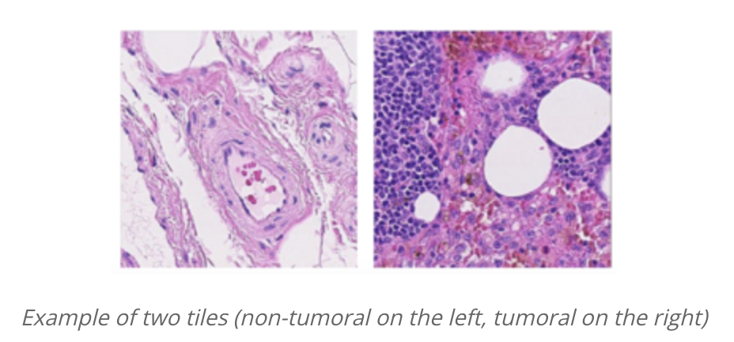

# Certainty Pooling for Multiple Instance Learning

This project proposes an implementation of [*Certainty Pooling for Multiple Instance Learning, Gildenblat et al.*](https://arxiv.org/pdf/2008.10548.pdf) on the data challenge [***Detecting breast cancer metastases***](https://challengedata.ens.fr/participants/challenges/18/) hosted by Owkin. 

## Code

The code is available on [ GitHub](https://github.com/hippolytelrm/certainty-pooling-mil)

## Introduction 

Multiple Instance Learning is a form of weakly supervised learning in which the data is arranged in sets of instances called bags with one label assigned per bag. The bag level class prediction is derived from the multiple instances through application of a permutation invariant pooling operator on instance predictions or embeddings.

## Certainty pooling 

Let us remind the Multiple Instance Pooling general assumptions. A bad is positive if at least one of the instances contains evidence for the label, that is, in our case, if at least one tile contains malignant cells. On the other hand, a bag is negative if all the instances does not contain evidence for the label (in our case, a slide is negative if all the tile contain normal cells). We define a bag as a group of instances $${x_1,...,x_K}$$ , where K is the size of the bag. It is important to note that K can vary and is not constant. $$Y ∈ {0, 1}$$ is the binary label associated with every bag. The equation below summarizes the Multiple Instance Learning assumption :

$$
Y=\left\{\begin{array}{l}0, \text { iff } y_{k}=0, \text { for } k \in\{1 \ldots K\} \\ 1, \quad \text { otherwise }\end{array}\right\}
$$

The Certainty Pooling operator appears to be an efficient pooling function in the case of low evidence ratio bags, compared to classical pooling operators. Indeed, the more a bag contains instances, the more likely the evidence ratio will be low. Hence, for cases of very low evidence ratio, an pooling operator like mean-pooling will perform poorly as the features of a likely positive instance might be hidden by an average with a high number of negative instances. Similarly, the max-pooling function is very likely to lead to false positive predictions.
The Certainty Pooling pooling method is based on the calculation of a certainty score that will be allocated to every instances of a bag. This certainty score is based on Monte- Carlo (MC) dropout, a method that measures certainty in Deep Learning models. The main idea behind the MC-dropout method is to use the dropout operator during test time in order to obtain different predictions with respect to the neurons that have been activated or not. From the obtained predictions, it is possible to compute estimator and, therefore, quantify the certainty or uncertainty of the model regarding the prediction.
In Certainty Pooling methods, we $$X_k$$ as the vector of MC dropout predictions for an instance $k$. The instance certainty score $C_k$ is defined as follow :

$$
C_{k}=C\left(X_{k}\right)=\frac{1}{\sigma\left(X_{k}\right)+\epsilon},
$$

where \$\sigma\$ is the standard deviation operator and $$\epsilon$$ is a small number that prevents division by zero.
The lower the standard deviation of the MC-Dropout vector $$X_{k}$$, the more the model will be certain about a prediction. In this case the instance certainty score $$C_{k}$$ will very high. Conversely, the less the model will be certain about a prediction, the higher the standard deviation of the MC-Dropout vector $$X_{k}$$ and the lower the instance certainty score $$C_{k}$$ will be.

Once the certainty score $$C_{k}$$ has been computed for all the instances $$k \in\{1 \ldots K\}$$, all the instances are multiplied using their respective certainty score $C_{k}$. Finally, the global bag level prediction $$Z_{m}$$ is defined as the prediction value of the instance having the highest certainty weighted model output. The equation of the Certainty Pooling is given in the equation below: 

$$
Z_{m}=h_{k^{*} m} \text { where } k^{*}=\operatorname{argmax}\left(C_{k} \cdot h_{k m}\right),
$$

where $k^{*}$ is the index of the instance having the highest certainty weighted model output.

Finally, the figure below displays the architecture of the Certainty Pooling method.

